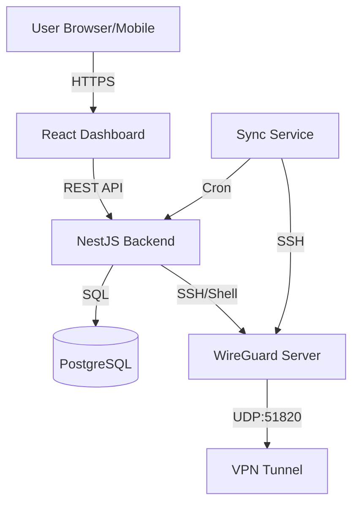

# 🏗️ System Architecture

## 1. High-Level Diagram

## 2. Tech Stack

### Frontend (Presentation)
*   **Core:** React 18+ (Vite ecosystem).
*   **Styling:** Tailwind CSS (Utility-first).
*   **State:** React Context API (Auth), Local Component State.
*   **Routing:** React Router v6+.
*   **Icons:** Lucide React.

### Backend (Logic)
*   **Runtime:** Node.js v20 (LTS).
*   **Framework:** NestJS (Modular, TypeScript).
*   **ORM:** TypeORM (Code-first approach).
*   **Auth:** JWT (JSON Web Tokens) with Passport.js strategy.
*   **Services:**
    *   `VpnService`: Core configuration logic.
    *   `SshService`: Remote command execution.
    *   `VpnSyncService`: State reconciliation and usage stats.

### Database (Persistence)
*   **Engine:** PostgreSQL 16.
*   **Hosting:** Docker Container (Dev), Managed Service (Prod).

### Networking (VPN)
*   **Protocol:** WireGuard®.
*   **Cryptography:** Curve25519 (Key Exchange), ChaCha20 (Encryption), Poly1305 (Auth).

## 3. Data Flow (Config Generation)
1.  **Request:** User clicks "Download Config" in Dashboard.
2.  **Auth:** API validates JWT.
3.  **Validation:** Check plan limits and server maintenance mode.
4.  **Keygen:** Backend generates Private/Public keypair.
5.  **Provisioning:** 
    *   `SshService` connects to server.
    *   Executes `wg set wg0 peer <KEY> allowed-ips <IP>`.
6.  **Storage:** Public Key stored in DB; Private Key sent to user then discarded.
7.  **Response:** `.conf` file returned with Server's real Public Key.

## 4. State Reconciliation
To ensure reliability, the `VpnSyncService` runs every 5 minutes:
1.  Connects to each active server via SSH.
2.  Runs `wg show wg0 dump`.
3.  Compares active peers on the interface with the `VpnConfig` table.
4.  Re-adds any missing peers (e.g., after a server reboot).